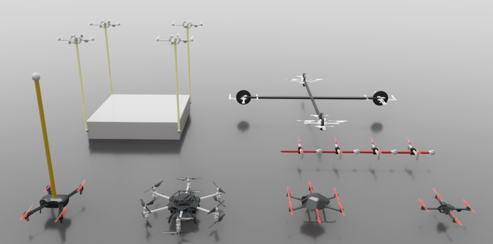

---

# OmniDrones

[](https://docs.omniverse.nvidia.com/app_isaacsim/app_isaacsim/overview.html)
[](https://docs.python.org/3/whatsnew/3.7.html)
[](https://omnidrones.readthedocs.io/en/latest/)
[](https://opensource.org/licenses/MIT)
[](https://discord.gg/J4QvXR6tQj)

*OmniDrones* is an open-source platform designed for reinforcement learning research on multi-rotor drone systems. Built on [Nvidia Isaac Sim](https://docs.omniverse.nvidia.com/app_isaacsim/app_isaacsim/overview.html), *OmniDrones* features highly efficient and flexible simulation that can be adopted for various research purposes. We also provide a suite of benchmark tasks and algorithm baselines to provide preliminary results for subsequent works.

For usage and more details, please refer to the [documentation](https://omnidrones.readthedocs.io/en/latest/). Unfortunately, it does not support Windows.

Welcome to join our [Discord](https://discord.gg/J4QvXR6tQj) for discussions and questions!

## Notice

The initial release of **OmniDrones** is developed based on Isaac Sim 2022.2.0. It can be found at the [release](https://github.com/btx0424/OmniDrones/tree/release) branch. The current version is developed based on Isaac Sim 4.1.0.

## Announcement 2023-09-25

The initial release of **OmniDrones** is developed based on Isaac Sim 2022.2.0. As the next version of
Isaac Sim (2023.1.0) is expected to bring substantial changes but is not yet available, the APIs and usage
of **OmniDrones** are subject to change. We will try our best to keep the documentation up-to-date.

## Announcement 2023-10-25

The new release of Isaac Sim (2023.1.0) has brought substantial changes as well as new possibilities, among
which the most important is new sensors. We are actively working on it at the `devel` branch. The `release`
branch will still be maintained for compatibility. Feel free to raise issues if you encounter any problems
or have ideas to discuss.

## Citation

Please cite [this paper](https://arxiv.org/abs/2309.12825) if you use *OmniDrones* in your work:

```bibtex
@misc{xu2023omnidrones,
    title={OmniDrones: An Efficient and Flexible Platform for Reinforcement Learning in Drone Control},
    author={Botian Xu and Feng Gao and Chao Yu and Ruize Zhang and Yi Wu and Yu Wang},
    year={2023},
    eprint={2309.12825},
    archivePrefix={arXiv},
    primaryClass={cs.RO}
}
```

## Acknowledgement

Some of the abstractions and implementation was heavily inspired by [Isaac Lab](https://github.com/isaac-sim/IsaacLab).
