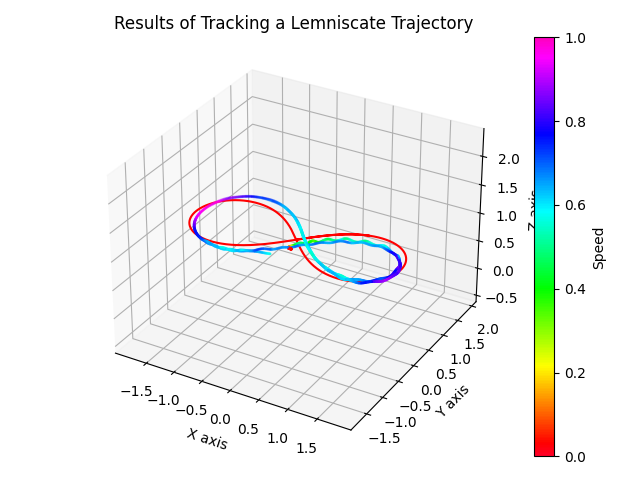
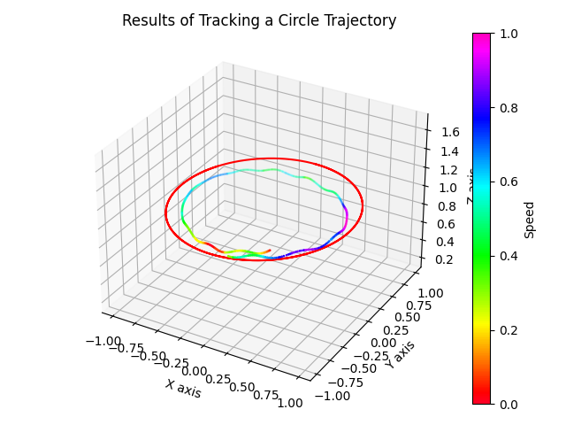

# Deployment on Crazyflie 2.1

We deploy a tracking policy trained using *OmniDrones* to a Crazyflie 2.1 nanocopter. 
The policy is trained using the **Track** task and the domain randomization utilities.

We use [crazyswarm2](https://github.com/IMRCLab/crazyswarm2) to operate the drone. 
The policy is trained with the action space transformed by a rate controller 
(`omni_drones.controllers.RateController`). The trained policy is interfaced to 
`crazyswarm` by converting the messages to and from tensor-based states. We show 
results of tracking a 8-shaped lemniscate trajectory and a circle at a low speed.


## Results

<div>
    <video width="320" height="240" controls>
        <source src="../_static/demo/trial-1.mp4" type="video/mp4">
    </video>
    <video width="320" height="240" controls>
        <source src="../_static/demo/trial-2.mp4" type="video/mp4">
    </video>
</div>

### Tracking Performance





As shown in the figures and videos, the tracking performance is not optimal. This 
could be attributed to several factors, such as action noise, sensor errors, and 
ground effects, considering the small size of the Crazyflie 2.1. To enhance its 
performance, we are actively working on refining both the simulation and deployment 
pipeline. For example, we are incorporating more complex noise models for action 
and observation to better account for real-world conditions.

## Quick Start

```{code-block} bash
:caption: OmniDrones/scripts/
python train.py headless=true eval_interval=200 task=TrackRand task.drone_model=crazyflie task.action_transform=rate 
```