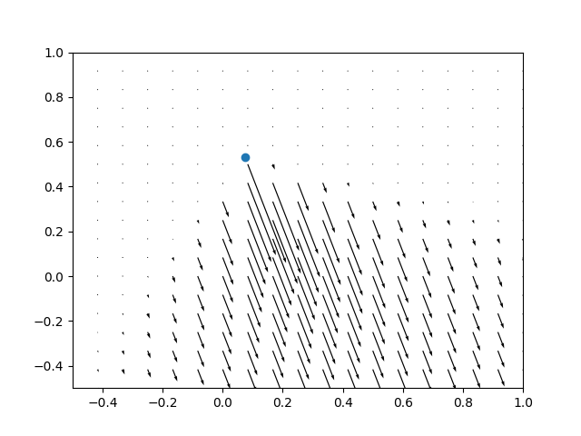

# Downwash between Multiple Drones

Multi-drone systems are gaining more attention due to its extended capacity. 
However, downwash effects emerge when multiple drones fly in proximity. This 
example shows the usage of a position controller and the downwash effects
between multiple drones. The model of downwash follows those described in 
this [paper](https://arxiv.org/abs/2207.09645) and this 
[paper](https://ieeexplore.ieee.org/stamp/stamp.jsp?tp=&arnumber=8798116).

The following quiver plot visualize the forces resulted from downwash around
a drone (in blue).

<video width="400" height="300" controls>
    <source src="../_static/demo/downwash.mp4" type="video/mp4">
</video>

