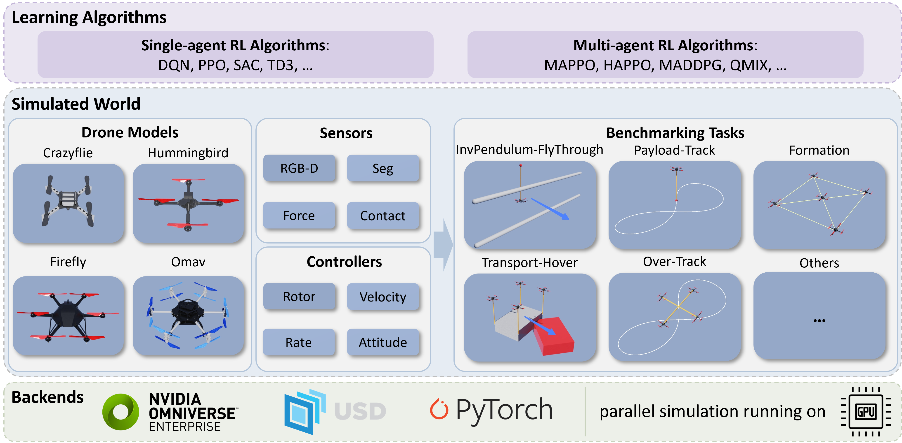

.. OmniDrones documentation master file, created by
   sphinx-quickstart on Wed Jul 26 19:36:56 2023.
   You can adapt this file completely to your liking, but it should at least
   contain the root `toctree` directive.

Welcome to OmniDrones's documentation!
======================================

**OmniDrones** is an open-source platform designed for reinforcement learning research on multi-rotor drone systems. 
Built on `Nvidia Isaac Sim <https://docs.omniverse.nvidia.com/app_isaacsim/app_isaacsim/overview.html>`__, 
**OmniDrones** features highly efficient and flxeible simulation that can be adopted for various research purposes. 

.. image:: _static/visualization.jpg
   :align: center

The platform, as released with `our paper <>`__, currently focus on end-to-end learning of agile controllers for drones. 
It offers a suite of benchmark tasks and algorithm baselines to provide preliminary results for subsequent works. 

An overview of the platform is shown below:

If you use **OmniDrones** in your research, please cite the paper with the following bibtex entry:

.. code-block:: bibtex

   @article{
   }

.. toctree::
   :caption: Getting Started
   :maxdepth: 1

   installation
   rl

.. toctree::
   :caption: Tutorials
   :maxdepth: 2
   
   drone
   environment
   controller
   tips

.. .. toctree::
..    :caption: Usage

..    tasks

.. .. toctree::
..    :caption: Misc.

..    roadmap

Indices and tables
==================

* :ref:`genindex`
* :ref:`modindex`
* :ref:`search`
