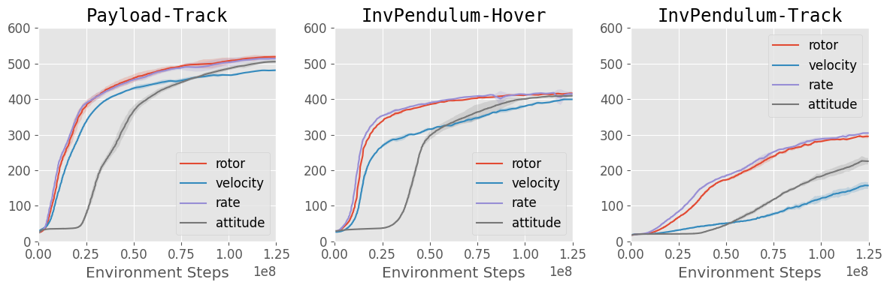

Controllers and Usage
======================

By default, the action space is such that the agent directly commands target 
thrusts of each rotor. However, we may sometimes want to use controllers that
accepts higher-level commands, such as target velocities or attitudes. 

We implement a few controllers in `omni_drones/controllers` following 
`RotorS <https://github.com/ethz-asl/rotors_simulator>`__, including a 
position/velocity controller, an attitude controller, and a rate controller.

Using the Controllers
----------------------

Adding Controllers
-------------------

RL Performance
---------------

We argue that although controllers make the actions more meaningful, they may 
be suboptimal when used in RL training if we do not tune the parameters 
and shape the action space properly.

We provide some results of training with different controllers in three tasks
with `Hummingbird`:

